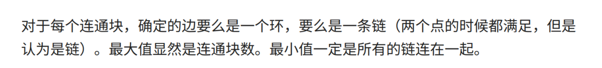

# 小白月赛 Round 72

### Summarize <a href="#name" id="name"></a>

<div align="center">

<figure><figcaption></figcaption></figure>

</div>

三道签到题，所以是手速场，手机卡在女朋友的手机里，所以暂时没法登我之前的账号，虽然之前的账号也就打了一场 Rating，所以就用校园卡新开了个账号，没想到分还不低

本来是要打完就赶紧去看数学建模的题的，谁知道了，这个 D 题这么难写，我用 dfs 连样例都没有过，但是都是感觉快要写出来了，虽然事实证明我想法错了，哈哈。

## B. 数数

### Problem Thought <a href="#problem-thought-1" id="problem-thought-1"></a>

​求 $$[1,n]$$ 中因子数量为奇数的正整数的个数。只有当一个数是某个数的平方的时候，这个数的因子数才是奇数，所以可以对与 $$i \in [1, \sqrt{4000}]$$，令 $$a_{i * i}= 1$$，然后求前缀和即可。

### Implementation <a href="#implementation-1" id="implementation-1"></a>

```cpp
int main () {
    int n, x, a[4e3 + 10] = {0};
    std::cin >> n;

    for (int i = 1; i < 70; i++) a[i * i] = 1;
    for (int i = 1; i < 4010; i++) a[i] += a[i - 1];

    while (n--) {
        std::cin >> x;
        std::cout << a[x] << '\n';    
    }
    
    return 0;
}
```

## C. 操作数组 <a href="#name-2" id="name-2"></a>

### Problem Thought <a href="#problem-thought-2" id="problem-thought-2"></a>

观察可以发现，当进行一次操作后，对数组的和没有改变，所以可以通过数组的和来判断两个数组是否满足题意，当和相等时，显然，当有一个 +1 的操作时，就有一个需要 -1 的操作被执行，我们只要贪心的求出需要多少个 +1 即可。

### Implementation <a href="#implementation-2" id="implementation-2"></a>

```cpp
typedef long long i64;

int main () {
    int n, suma = 0, sumb = 0;
    std::cin >> n;
    std::vector<int> a(n), b(n);
    
    for (int i = 0; i < n; i++) std::cin >> a[i], suma += a[i];
    for (int i = 0; i < n; i++) std::cin >> b[i], sumb += b[i];
    
    if (suma != sumb) {
        std::cout << "-1\n";
        return 0;
    }
    
    i64 ans = 0;
    for (int i = 0; i < n; i++) {
        if (a[i] > b[i]) ans += a[i] - b[i];
    }    
    
    std::cout << ans << "\n";    
}
```

### ​ <a href="#undefined" id="undefined"></a>

## D. 遗迹探险 <a href="#name-3" id="name-3"></a>

### Problem Thought <a href="#problem-thought-3" id="problem-thought-3"></a>

​

### Implementation <a href="#implementation-3" id="implementation-3"></a>

​​

## E. 顶级厨师 <a href="#name-4" id="name-4"></a>

### Problem Thought <a href="#problem-thought-4" id="problem-thought-4"></a>

​

### Implementation <a href="#implementation-4" id="implementation-4"></a>
