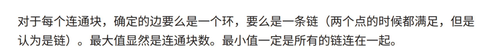

# 小白月赛 Round 72

### Summarize <a href="#name" id="name"></a>

<div align="center">

<figure><figcaption></figcaption></figure>

</div>

三道签到题，所以是手速场，手机卡我在我这里，暂时没法儿登我之前的账号（虽然之前的账号也就打了一场 Rating，分还没这把给的多），所以就用校园卡新开了个账号，没想到结算完成一看分还不低。其实本来是要写一两道就得赶紧去看数学建模的题的，谁知道这个 D 题这么难写，我用 DFS 连第一个样例都没有过，气得我一直写一直写，一下从本来七点半要结束的场写到了八点半，还是没有写出来，哈哈哈哈。


## A. 跳跃游戏

### Problem Thought <a href="#problem-thought-1" id="problem-thought-1"></a>

​只要 $$a_i < a_j ,\  i < j$$  即可从第 $$i$$ 个位置跳到第 $$j$$ 个位置，所以只考虑第一个和最后一个即可。

### Implementation <a href="#implementation-1" id="implementation-1"></a>

```cpp
int main () {
    int n;
    std::cin >> n;
    
    std::vector<int> a(n);
    for (int i = 0; i < n; i++) std::cin >> a[i];
    
    if (a[0] < a[n - 1]) std::cout << "YES\n";
    else std::cout << "NO\n";
}
```


## B. 数数

### Problem Thought <a href="#problem-thought-1" id="problem-thought-1"></a>

​求 $$[1,n]$$ 中因子数量为奇数的正整数的个数。只有当一个数是某个数的平方的时候，这个数的因子数才是奇数，所以可以对与 $$i \in [1, \sqrt{4000}]$$，令 $$a_{i * i}= 1$$，然后求前缀和即可。

### Implementation <a href="#implementation-1" id="implementation-1"></a>

```cpp
int main () {
    int n, x, a[4e3 + 10] = {0};
    std::cin >> n;

    for (int i = 1; i < 70; i++) a[i * i] = 1;
    for (int i = 1; i < 4010; i++) a[i] += a[i - 1];

    while (n--) {
        std::cin >> x;
        std::cout << a[x] << '\n';    
    }
    
    return 0;
}
```


## C. 操作数组 <a href="#name-2" id="name-2"></a>

### Problem Thought <a href="#problem-thought-2" id="problem-thought-2"></a>

观察可以发现，当进行一次操作后，对数组的和没有改变，所以可以通过数组的和来判断两个数组是否满足题意，当和相等时，显然，当有一个 +1 的操作时，就有一个需要 -1 的操作被执行，我们只要贪心的求出需要多少个 +1 即可。

### Implementation <a href="#implementation-2" id="implementation-2"></a>

```cpp
typedef long long i64;

int main () {
    int n, suma = 0, sumb = 0;
    std::cin >> n;
    std::vector<int> a(n), b(n);
    
    for (int i = 0; i < n; i++) std::cin >> a[i], suma += a[i];
    for (int i = 0; i < n; i++) std::cin >> b[i], sumb += b[i];
    
    if (suma != sumb) {
        std::cout << "-1\n";
        return 0;
    }
    
    i64 ans = 0;
    for (int i = 0; i < n; i++) {
        if (a[i] > b[i]) ans += a[i] - b[i];
    }    
    
    std::cout << ans << "\n";    
}
```


## D. 遗迹探险 <a href="#name-3" id="name-3"></a>

### Problem Thought <a href="#problem-thought-3" id="problem-thought-3"></a>

​假设没有传送门存在的话，因为一个位置只有两种子状态，所以我们可以通过枚举每一个 $$i, \ j$$ 求出当从初始位置达到这个位置时的最大收获，此时 $$f(n, \ m)$$ 即为到达终点的最大收获；当有传送门时，考虑到传送门的数量不会特别多，所以直接枚举即可，按照我们上述描述，如果进入传送门，就还需要确定从传送到的那个位置到终点该怎么走才能收获最大，所以我们可以再预处理一个 $$g(i, \ j)$$ 表示从 $$(i, \ j)$$ 到终点的最大收获。

### Implementation <a href="#implementation-3" id="implementation-3"></a>

```cpp
const int N = 1e3 + 10;
i64 g[N][N], f[N][N];
int a[N][N];

void sol() {
    int n, m, k, T;
    std::cin >> n >> m;
    
    i64 inf = 1e18;    
    std::fill(f[1], f[1] + N * N, -inf);
    std::fill(g[1], g[1] + N * N, -inf);

    for (int i = 1; i <= n; i++)
        for (int j = 1; j <= m; j++)
            std::cin >> a[i][j];

    f[0][1] = 0;
    for (int i = 1; i <= n; i++)
        for (int j = 1; j <= m; j++)
            f[i][j] = std::max(f[i][j - 1], f[i - 1][j]) + a[i][j];

    g[n][m + 1] = 0;
    for (int i = n; i > 0; i--)
        for (int j = m; j > 0; j--)
            g[i][j] = std::max(g[i + 1][j], g[i][j + 1]) + a[i][j];

    std::cin >> T;
    while (T--) {
        std::cin >> k;
        std::vector<int> drx(k), dry(k);

        for (int i = 0; i < k; i++)
            std::cin >> drx[i] >> dry[i];

        i64 ans = f[n][m];
        for (int i = 0; i < k; i++) {
            for (int j = 0; j < k; j++) {
                if (i == j) continue;
                ans = std::max(ans, f[drx[i]][dry[i]] + g[drx[j]][dry[j]]);
            }
        }

        std::cout << ans << '\n';
    }
}
```


## E. 顶级厨师 <a href="#name-4" id="name-4"></a>

### Problem Thought <a href="#problem-thought-4" id="problem-thought-4"></a>

​假设每一种做法都允许，对于寻找 $$n \times m$$ 种组合中的第 k 小的数，因为数据过大所以不能直接构成 $$n \times m$$ 大的数组。我们可以二分一个值，判断他是第几小，然后二分出答案。对于 check 函数，我们可以用双指针算法，将数组 $$a, \ b$$ 排序后，因为对于$$a_i \times b_j > mid$$ 一定有 $$a_{i + 1} \times b_j > mid$$，所以我们可以使指针 $$i$$ 从头开始枚举，$$j$$ 从尾部开始枚举，找到满足小于等于 $$mid$$ 值的组合的数量。

对于附加条件，计算之后排序，每次二分减去小于等于 $$mid$$ 的数量即可。

### Implementation <a href="#implementation-4" id="implementation-4"></a>

```cpp
void sol() {
    int n, m, K, Q;
    std::cin >> n >> m >> K >> Q;

    std::vector<int> a(n), b(m);
    std::vector<i64> ban(K);

    for (auto & i : a) std::cin >> i;
    for (auto & i : b) std::cin >> i;

    for (int i = 0, u, v; i < K; i++) {
        std::cin >> u >> v;
        ban[i] = a[u - 1] * b[v - 1];
    }

    std::sort(a.begin(), a.end());
    std::sort(b.begin(), b.end());
    std::sort(ban.begin(), ban.end());

    auto check = [&](auto mid, auto x) {
        i64 res = 0;
        for (int i = 0, j = m - 1; i < n && j >= 0; i++) {
            while (j >= 0 && 1ll * a[i] * b[j] > mid) j--;
            res += j + 1;
        }
        res -= (std::upper_bound(ban.begin(), ban.end(), mid) - ban.begin());
        return res < x;
    };

    auto binary_search = [&](auto x) {
        i64 l = 0, r = 1e12 + 10;
        while (l + 1 != r) {
            i64 mid = l + r >> 1;
            if (check(mid, x)) l = mid;
            else r = mid;
        }
        return r;
    };

    while (Q--) {
        int x;
        std::cin >> x;
        std::cout << binary_search(x) << '\n';
    }
}
```
